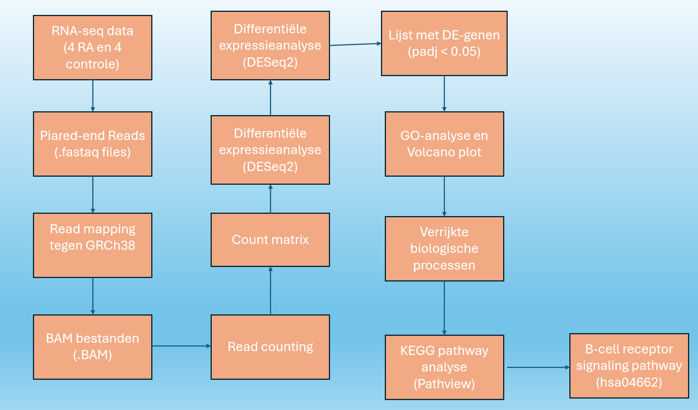
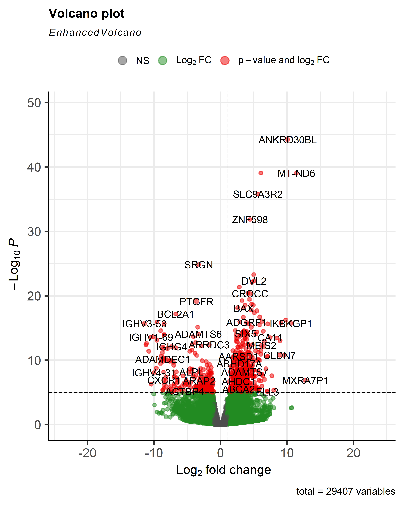
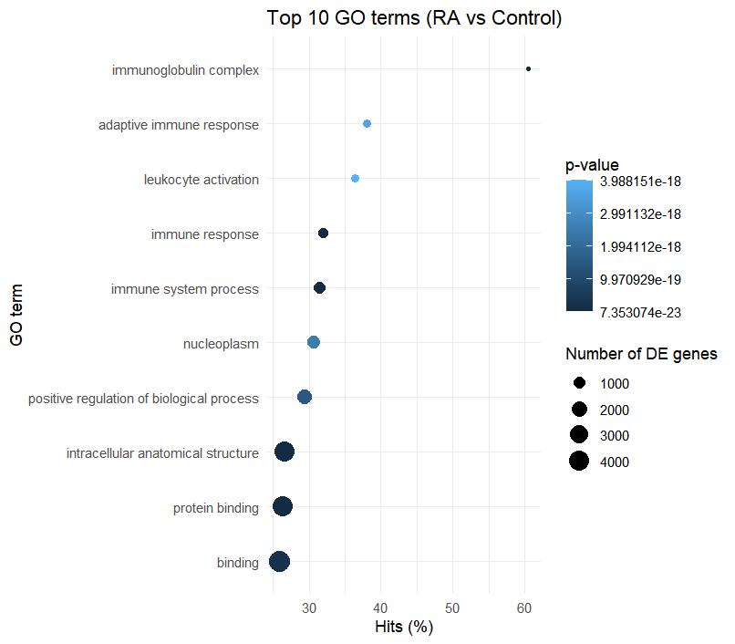
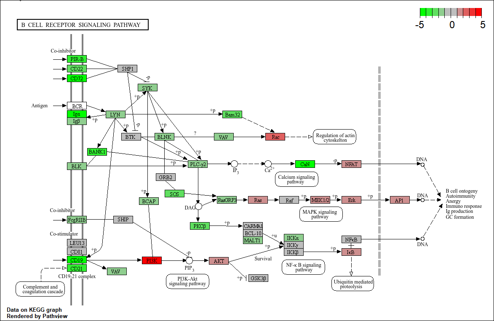

# RA_project
## Transcriptomics analyse van synoviumweefsel van patiënten met reumatoïde artritis

## Introductie
Reumatoïde artritis (RA) is een chronische systemische auto-immuunziekte die voornamelijk de synoviale gewrichten aantast. De ziekte wordt gekenmerkt door ontsteking van het synovium, wat uiteindelijk kan leiden tot kraakbeenafbraak, boterosie en verlies van gewrichtsfunctie. Hoewel de exacte oorzaak van RA nog niet volledig bekend is, spelen genetische aanleg, omgevingsfactoren en ontregeling van het immuunsysteem een belangrijke rol bij het ontstaan van de ziekte (Gabriel, 2001). Een belangrijk kenmerk van RA is de aanwezigheid van autoantistoffen, waaronder anti-citrullinated protein antibodies (ACPA), die vaak al vóór het ontstaan van klinische symptomen aantoonbaar zijn (Majithia & Geraci, 2007).
Transcriptomics maakt het mogelijk om op grote schaal genexpressie te bestuderen en biedt daardoor inzicht in de moleculaire mechanismen die betrokken zijn bij ziekteprocessen. Door verschillen in genexpressie tussen patiënten en gezonde controles te analyseren, kunnen betrokken genen en biologische pathways worden geïdentificeerd (Wang et al., 2009). Eerdere studies hebben aangetoond dat immuunactivatie, B-celactiviteit, cytokinesignalering en ontstekingsprocessen een centrale rol spelen bij RA (McInnes & Schett, 2011).
In deze studie werd RNA-seq data afkomstig van synoviumbiopten van vier patiënten met vastgestelde RA en vier controlepersonen geanalyseerd. Het doel van het onderzoek was om genen en biologische processen te identificeren die differentieel tot expressie komen bij RA en om de betrokken pathways verder te onderzoeken met behulp van Gene Ontology (GO)- en KEGG-pathwayanalyses. 

## Methoden

Voor deze studie werd gebruikgemaakt van publieke paired-end RNA-sequencingdata afkomstig van synoviumbiopten van vier vrouwelijke patiënten met gevestigde reumatoïde artritis (54–66 jaar) en vier vrouwelijke controlepersonen zonder RA (15–42 jaar).

**Figuur 1.** Overzicht van de uitgevoerde transcriptomics-analyse.

Zoals weergegeven in **Figuur 1** werden de analyses uitgevoerd in R (versie 4.5.2). Eerst werd het humane referentiegenoom GRCh38 (GCF_000001405.26) geïndexeerd met behulp van het package **Rsubread**. Vervolgens werden paired-end RNA-seq reads gemapt tegen het referentiegenoom met de functie `align()`. De resulterende BAM-bestanden werden gesorteerd en geïndexeerd met **Rsamtools**.

Voor het bepalen van genexpressie werd met `featureCounts()` een count matrix gegenereerd op basis van een GTF-annotatiebestand afkomstig van dezelfde referentieversie als het gebruikte genoom. De count matrix bevatte gen-specifieke readaantallen voor alle acht samples.

Differentiële genexpressie tussen de RA-groep en controlegroep werd bepaald met het package **DESeq2**. Hierbij werden de ruwe counts genormaliseerd en statistisch vergeleken. Genen met een aangepaste p-waarde (*padj*) kleiner dan 0,05 werden als significant beschouwd.

Vervolgens werd met het package **goseq** een Gene Ontology (GO)-analyse uitgevoerd om verrijkte biologische processen te identificeren. De resultaten werden gevisualiseerd in een volcano plot en een GO-verrijkingsplot. Op basis van de GO-resultaten werd een KEGG-pathway geselecteerd voor verdere analyse. Hiervoor werd met het package **Pathview** de **B-cell receptor signaling pathway (hsa04662)** gevisualiseerd.

## Resultaten

De differentiële expressieanalyse resulteerde in een groot aantal genen met significante verschillen in expressie tussen RA-patiënten en controles. De resultaten werden gevisualiseerd met een volcano plot (Figuur 2). Hierin zijn genen weergegeven o.b.v. hun log2fold change en gecorrigeerde p-waarde. Zowel opgereguleerde als neer-gereguleerde genen werden waargenomen. Onder de sterkst veranderde genen bevonden zich meerdere immuungerelateerde genen, waaronder immunoglobuline-gerelateerde genen.

**Figuur 2.** Volcano plot van differentieel geëxpresseerde genen tussen RA-patiënten en controles.

De Gene Ontology-analyse liet zien dat verschillende immuungerelateerde processen significant verrijkt waren (Figuur 3). De meest verrijkte termen waren onder andere immunoglobulin complex, adaptive immune response, leukocyte activation, immune response en immune system process. Daarnaast werden ook algemene moleculaire functies zoals binding en protein binding geïdentificeerd.

**Figuur 3. Top 10 verrijkte GO-termen.
O.b.v. deze resultaten werd de KEGG-pathway B cell receptor signaling pathway (hsa04662) verder onderzocht. Binnen deze pathway werden meerdere genen met veranderde expressie geïdentificeerd (Figuur 4). Zowel verhoogde als verlaagde expressie van componenten binnen de B-cel signaleringscascade werden waargenomen. Verschillende genen betrokken bij signaaltransductie en activatie van B-cellen vertoonden veranderingen in expressie tussen de onderzochte groepen.

**Figuur 4. B-cell receptor signaling pathway (hsa04662).
