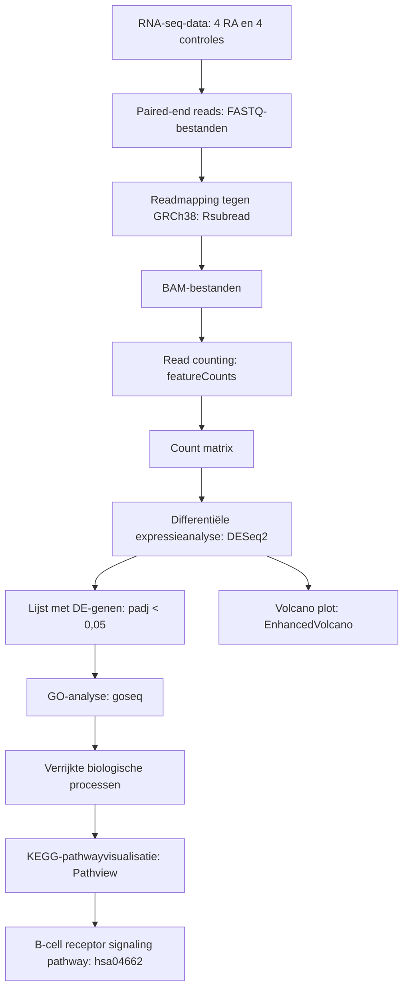
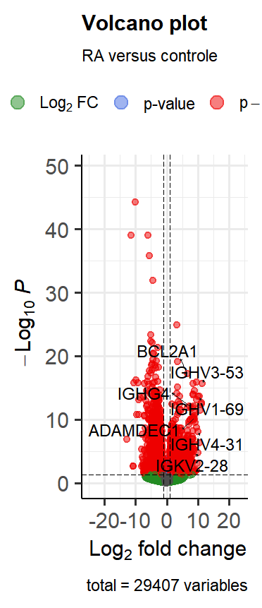
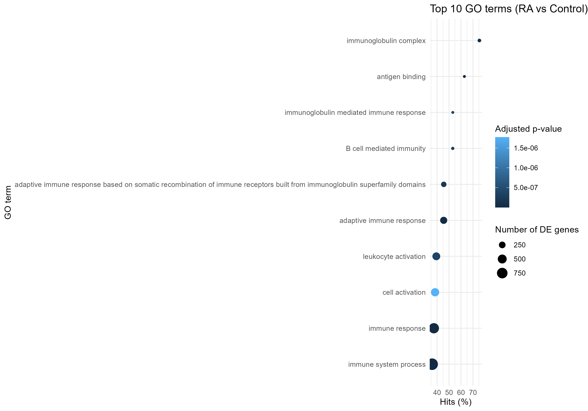
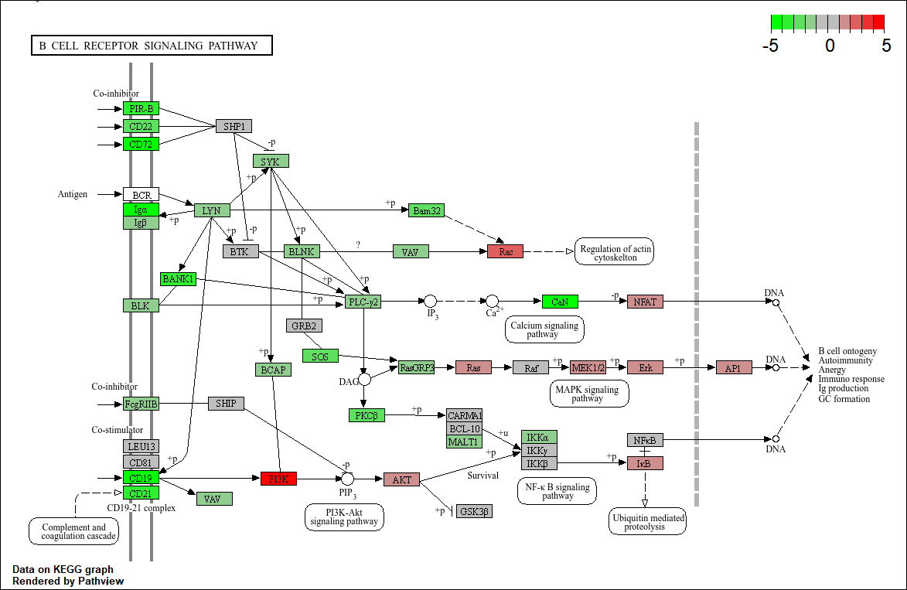

# RA_project
## Transcriptomics analyse van synoviumweefsel van patiënten met reumatoïde artritis

## Inhoud/structuur

In deze repository zijn het R-script, de figuren en het verslag van de transcriptomics-analyse van reumatoïde artritis (RA) opgenomen.

- [Script](Script/) – R-script voor de verwerking en analyse van RNA-seq-data.
- [Data](Data/) – de gebruikte data voor dit analyse
- [Figuren](Figuren/) – Workflow, volcano plot, GO-grafiek en KEGG-visualisatie.
- [README.md](README.md) – Verslag van het onderzoek.

### Inhoudsopgave

- [Introductie](#introductie)
- [Methoden](#methoden)
- [Resultaten](#resultaten)
- [Conclusie](#conclusie)
- [Databeheer](#databeheer)
- [Referenties](#referenties)

## Introductie
Reumatoïde artritis (RA) is een chronische systemische auto-immuunziekte die voornamelijk de synoviale gewrichten aantast. De ziekte wordt gekenmerkt door ontsteking van het synovium, wat uiteindelijk kan leiden tot kraakbeenafbraak, boterosie en verlies van gewrichtsfunctie. Hoewel de exacte oorzaak van RA nog niet volledig bekend is, spelen genetische aanleg, omgevingsfactoren en ontregeling van het immuunsysteem een belangrijke rol bij het ontstaan van de ziekte (Gabriel, 2001). Een belangrijk kenmerk van RA is de aanwezigheid van autoantistoffen, waaronder anti-citrullinated protein antibodies (ACPA), die vaak al vóór het ontstaan van klinische symptomen aantoonbaar zijn (Majithia & Geraci, 2007).
Transcriptomics maakt het mogelijk om op grote schaal genexpressie te bestuderen en biedt daardoor inzicht in de moleculaire mechanismen die betrokken zijn bij ziekteprocessen. Door verschillen in genexpressie tussen patiënten en gezonde controles te analyseren, kunnen betrokken genen en biologische pathways worden geïdentificeerd (Wang et al., 2009). Eerdere studies hebben aangetoond dat immuunactivatie, B-celactiviteit, cytokinesignalering en ontstekingsprocessen een centrale rol spelen bij RA (McInnes & Schett, 2011).
In deze studie werd RNA-seq data afkomstig van synoviumbiopten van vier patiënten met vastgestelde RA en vier controlepersonen geanalyseerd. Het doel van het onderzoek was om genen en biologische processen te identificeren die differentieel tot expressie komen bij RA en om de betrokken pathways verder te onderzoeken met behulp van Gene Ontology (GO)- en KEGG-pathwayanalyses. 

## Methoden

### Onderzoeksmateriaal en databron

Voor dit onderzoek werd gebruikgemaakt van publieke RNA-sequencingdata van synoviumbiopten van patiënten met reumatoïde artritis (RA) en gezonde controlepersonen. De oorspronkelijke sequencingdata zijn beschikbaar via de [NCBI Gene Expression Omnibus (GEO), dataset GSE89408](https://www.ncbi.nlm.nih.gov/geo/query/acc.cgi?acc=GSE89408), behorend bij [BioProject PRJNA352076](https://www.ncbi.nlm.nih.gov/bioproject/PRJNA352076).

Voor de analyse werden acht vrouwelijke proefpersonen geselecteerd: vier patiënten met RA (54–66 jaar) en vier gezonde controles (15–42 jaar). De RA-patiënten waren positief voor anti-citrullinated protein antibodies (ACPA).

De gebruikte SRA-runs waren:

| Onderzoeksgroep | SRA-runs | Aantal |
|---|---|---|
| RA | SRR4785979, SRR4785980, SRR4785986, SRR4785988 | 4 |
| Gezonde controles | SRR4785819, SRR4785820, SRR4785828, SRR4785831 | 4 |

### Overzicht van de analyse

De uitgevoerde stappen zijn schematisch weergegeven in Figuur 1.

```mermaid
flowchart TD
    A["RNA-seq-data: 4 RA en 4 controles"]
    B["Paired-end reads: FASTQ-bestanden"]
    C["Readmapping tegen GRCh38: Rsubread"]
    D["BAM-bestanden"]
    E["Read counting: featureCounts"]
    F["Count matrix"]
    G["Differentiële expressieanalyse: DESeq2"]
    H["Lijst met DE-genen: padj < 0,05"]
    I["GO-analyse: goseq"]
    J["Verrijkte biologische processen"]
    K["KEGG-pathwayvisualisatie: Pathview"]
    L["B-cell receptor signaling pathway: hsa04662"]
    V["Volcano plot: EnhancedVolcano"]

    A --> B
    B --> C
    C --> D
    D --> E
    E --> F
    F --> G
    G --> H
    H --> I
    I --> J
    J --> K
    K --> L
    G --> V
```

**Figuur 1.** Schematisch overzicht van de transcriptomics-workflow, bestaande uit readmapping, genkwantificatie, differentiële genexpressieanalyse, GO-verrijkingsanalyse en KEGG-pathwayvisualisatie. Het schema toont de algemene verwerkingsstappen

### RNA-seq-verwerking en genkwantificatie

De bio-informatica-analyses werden uitgevoerd in **R (versie 4.5.2)**. Voor de verwerking van ruwe sequencingdata werden paired-end FASTQ-subsets gebruikt, aangeduid als `subset40k`.

Het humane referentiegenoom **GRCh38** ([NCBI RefSeq-assembly GCF_000001405.26](https://www.ncbi.nlm.nih.gov/datasets/genome/GCF_000001405.26/)) werd geïndexeerd met `buildindex()` uit **Rsubread (versie 2.24.0)** ([Liao et al., 2019](https://doi.org/10.1093/nar/gkz114)). Vervolgens werden de paired-end reads met `align()` tegen het referentiegenoom gemapt.

De gegenereerde BAM-bestanden werden gesorteerd en geïndexeerd met `sortBam()` en `indexBam()` uit **[Rsamtools (versie 2.26.0)](https://bioconductor.org/packages/Rsamtools/)**.

Voor de genkwantificatie werd `featureCounts()` uit Rsubread gebruikt met de parameters `isPairedEnd = TRUE`, `isGTFAnnotationFile = TRUE`, `GTF.attrType = "gene_id"` en `useMetaFeatures = TRUE`.

Hierbij werd het NCBI RefSeq-annotatiebestand **`genomic.gtf`** gebruikt. De metadata van dit bestand vermeldden:

- Genoomversie: **GRCh38.p14**
- NCBI-assembly: **GCF_000001405.40**
- Annotatiebron: **NCBI RefSeq**
- Annotatierelease: **RS_2025_08**
- Annotatiedatum: **1 augustus 2025**

De bijbehorende annotatie is te vinden via [NCBI Genome Assembly GCF_000001405.40](https://www.ncbi.nlm.nih.gov/datasets/genome/GCF_000001405.40/).

De verwerking van de FASTQ-subsets resulteerde in een count matrix. Voor de daaropvolgende differentiële genexpressieanalyse werd **`count_matrix_RA.txt`** gebruikt, met tellingen voor **29.407 genen en acht samples**.

### Differentiële genexpressieanalyse

Differentiële genexpressie tussen RA-patiënten en gezonde controles werd onderzocht met **DESeq2 (versie 1.50.2)** ([Love et al., 2014](https://doi.org/10.1186/s13059-014-0550-8)).

De count matrix werd ingelezen in R. Vervolgens werd met `DESeqDataSetFromMatrix()` een dataset samengesteld, waarbij de acht SRA-runs aan de juiste onderzoeksgroepen werden gekoppeld. De groepsindeling werd opgenomen als verklarende variabele met `design = ~ treatment`.

Met `DESeq()` werden de tellingen genormaliseerd, dispersies geschat en verschillen in genexpressie statistisch getoetst. Vervolgens werden met `results()` de log2-fold changes en p-waarden bepaald.

De vergelijking werd expliciet ingesteld als **RA ten opzichte van gezonde controles** met `contrast = c("treatment", "Reuma", "control")`. Een positieve log2-fold change betekende hierdoor hogere expressie bij RA, terwijl een negatieve waarde lagere expressie bij RA aangaf.

De p-waarden werden met de **Benjamini-Hochberg-methode** gecorrigeerd voor multiple testing. Genen met een aangepaste p-waarde (`padj`) kleiner dan **0,05** werden als significant differentieel geëxpresseerd beschouwd. Voor de afzonderlijke aantallen sterker op- en neergereguleerde genen werden respectievelijk `log2FoldChange > 1` en `log2FoldChange < -1` toegepast.

De resultaten werden weergegeven in een volcano plot met **[EnhancedVolcano](https://bioconductor.org/packages/EnhancedVolcano/)**.

### Gene Ontology-verrijkingsanalyse

Om te onderzoeken welke biologische functies en processen oververtegenwoordigd waren onder de differentieel geëxpresseerde genen, werd een **Gene Ontology (GO)-verrijkingsanalyse** uitgevoerd met **goseq (versie 1.62.0)** ([Young et al., 2010](https://doi.org/10.1186/gb-2010-11-2-r14)).

Eerst werden de genen geselecteerd waarvoor een aangepaste DESeq2-p-waarde beschikbaar was. Vervolgens werd een binaire genvector samengesteld, waarbij significant differentieel geëxpresseerde genen (`padj < 0,05`) de waarde **1** kregen en overige geteste genen de waarde **0**.

Met `nullp()` werd een *probability weighting function* berekend om te corrigeren voor mogelijke selectiebias. Hiervoor werd de som van de read counts per gen gebruikt als biasvariabele (`bias.data`).

De GO-overrepresentatieanalyse werd uitgevoerd met `goseq()`, met de annotatie-instellingen `genome = "hg19"` en `id = "geneSymbol"`.

De p-waarden voor overrepresentatie (`over_represented_pvalue`) werden met `p.adjust(method = "BH")` gecorrigeerd voor multiple testing. GO-termen met een aangepaste p-waarde (`padj`) kleiner dan **0,05** werden als significant beschouwd.

De tien hoogst gerangschikte significante GO-termen werden geselecteerd met **[dplyr](https://dplyr.tidyverse.org/)** en gevisualiseerd met **[ggplot2](https://ggplot2.tidyverse.org/)**.

In de dotplot gaf de horizontale as het percentage differentieel geëxpresseerde genen binnen de GO-term weer. De puntgrootte vertegenwoordigde het aantal differentieel geëxpresseerde genen en de kleur de aangepaste p-waarde.

### KEGG-pathwayvisualisatie

Voor verdere interpretatie van de immuungerelateerde expressieverschillen werd de humane **B-cell receptor signaling pathway** geselecteerd ([KEGG: hsa04662](https://www.kegg.jp/pathway/hsa04662)).

De gensymbolen uit de DESeq2-resultaten werden met `mapIds()` uit **[AnnotationDbi](https://bioconductor.org/packages/AnnotationDbi/)** en de humane annotatiedatabase **[org.Hs.eg.db](https://bioconductor.org/packages/org.Hs.eg.db/)** omgezet naar Entrez Gene-ID's.

Wanneer meerdere mogelijke Entrez-ID's beschikbaar waren, werd met `multiVals = "first"` de eerste koppeling gekozen. Genen zonder geldige Entrez-ID of met ontbrekende of niet-eindige log2-fold changes werden uitgesloten van de visualisatie.

Met **Pathview (versie 1.50.0)** ([Luo & Brouwer, 2013](https://doi.org/10.1093/bioinformatics/btt285)) werden de log2-fold changes geprojecteerd op de geselecteerde KEGG-pathway.

Hierbij werden de volgende instellingen toegepast: `pathway.id = "hsa04662"`, `species = "hsa"`, `gene.idtype = "ENTREZID"` en `limit = list(gene = 5)`.

De Pathview-figuur werd gebruikt om de richting en grootte van genexpressieverschillen binnen deze pathway te visualiseren. Er werd **geen afzonderlijke statistische KEGG-verrijkingsanalyse** uitgevoerd.

### Reproduceerbaarheid en beperkingen

Het gebruikte R-script is beschikbaar in de [Script-map van de GitHub-repository](https://github.com/FreeEldia/RA_project/tree/main/Script).
## Resultaten
### Differentiële genexpressie tussen RA en gezonde controles

Om vast te stellen welke genen verschillen in expressie tussen synoviumweefsel van patiënten met reumatoïde artritis (RA) en gezonde controles, werd een differentiële genexpressieanalyse uitgevoerd met DESeq2.

In totaal werden **5.119 significant differentieel geëxpresseerde genen** geïdentificeerd (`padj < 0,05`). Hiervan vertoonden **2.085 genen een hogere expressie bij RA** (`log2FoldChange > 1`) en **2.487 genen een lagere expressie bij RA** (`log2FoldChange < -1`). De overige 547 significante genen voldeden niet aan deze aanvullende fold-changegrenzen.

Onder de sterk opgereguleerde genen bevonden zich *BCL2A1* (log2FC = 6,71; padj = 6,75 × 10⁻¹⁸) en *ADAMDEC1* (log2FC = 8,65; padj = 6,83 × 10⁻¹¹).

Daarnaast vertoonden verschillende immunoglobuline-gerelateerde genen een significant hogere expressie bij RA, waaronder *IGHV3-53* (log2FC = 11,43), *IGHV1-69* (log2FC = 10,44), *IGHG4* (log2FC = 7,35), *IGHV4-31* (log2FC = 10,01) en *IGKV2-28* (log2FC = 10,04). Al deze genen hadden een aangepaste p-waarde kleiner dan 0,05.

Om de richting en statistische significantie van de genexpressieverschillen zichtbaar te maken, werden de resultaten weergegeven in een volcano plot (**Figuur 2**). Hierbij staan genen met een hogere expressie bij RA rechts van nul en genen met een lagere expressie bij RA links van nul.

**Figuur 2.** Volcano plot van differentiële genexpressie tussen RA-patiënten en gezonde controles. De x-as toont de log2-fold change (RA ten opzichte van controle) en de y-as de −log10 van de aangepaste p-waarde (`padj`). Rode punten voldoen aan zowel de significantiegrens (`padj < 0,05`) als de fold-changegrens (`|log2FC| > 1`). Groene punten voldoen alleen aan het fold-changecriterium; grijze punten voldoen aan geen van beide criteria. De genen *BCL2A1*, *ADAMDEC1*, *IGHV3-53* en *IGHV1-69* zijn ter illustratie gelabeld.

### Gene Ontology-verrijkingsanalyse

Om te onderzoeken welke biologische processen, moleculaire functies en cellulaire componenten oververtegenwoordigd waren onder de differentieel geëxpresseerde genen, werd een Gene Ontology (GO)-verrijkingsanalyse uitgevoerd met goseq.

Na correctie voor multiple testing met de Benjamini-Hochberg-methode werden **88 significant oververtegenwoordigde GO-termen** geïdentificeerd (`padj < 0,05`).

De sterkst verrijkte GO-termen waren *immunoglobulin complex* (padj = 3,38 × 10⁻²⁶), *adaptive immune response* (padj = 9,56 × 10⁻²⁰) en *immune response* (padj = 2,58 × 10⁻¹³).

Daarnaast werden onder andere *antigen binding* (padj = 4,08 × 10⁻¹³), *immune system process* (padj = 8,13 × 10⁻¹²), *B cell mediated immunity* (padj = 2,39 × 10⁻⁷), *leukocyte activation* (padj = 3,57 × 10⁻⁷) en *immunoglobulin mediated immune response* (padj = 3,90 × 10⁻⁷) als significant oververtegenwoordigd geïdentificeerd.

Om de belangrijkste GO-resultaten onderling te vergelijken, werden de tien sterkst verrijkte GO-termen weergegeven in een dotplot (**Figuur 3**).

**Figuur 3.** Dotplot van de tien sterkst verrijkte GO-termen onder de differentieel geëxpresseerde genen. De horizontale as geeft het percentage differentieel geëxpresseerde genen binnen een GO-term weer. De puntgrootte vertegenwoordigt het aantal differentieel geëxpresseerde genen per GO-term en de kleur geeft de Benjamini-Hochberg-gecorrigeerde p-waarde weer.

De oververtegenwoordiging van *immunoglobulin complex*, *adaptive immune response* en *B cell mediated immunity* laat zien dat immuungerelateerde en B-celgerelateerde functies sterk vertegenwoordigd zijn onder de genen waarvan de expressie verschilt tussen RA-patiënten en gezonde controles.

### KEGG-pathwayvisualisatie van B-celsignalering

Om de gevonden immuungerelateerde expressieverschillen verder te onderzoeken binnen een bekende biologische signaalroute, werd de humane **B-cell receptor signaling pathway (hsa04662)** geselecteerd voor visualisatie met Pathview.

Deze pathway werd gekozen vanwege de significante verrijking van GO-termen die samenhangen met de adaptieve immuunrespons, immunoglobulinen en B-celgerelateerde functies.

De log2-fold changes uit de DESeq2-analyse werden gekoppeld aan de genen binnen deze KEGG-pathway en weergegeven in **Figuur 4**. Hierbij waren zowel positieve als negatieve veranderingen in genexpressie zichtbaar.

**Figuur 4.** KEGG B-cell receptor signaling pathway (hsa04662), gevisualiseerd met Pathview. De kleuren geven de log2-fold changes weer voor RA ten opzichte van gezonde controles. Rode vakken vertegenwoordigen positieve log2-fold changes (hogere expressie bij RA) en groene vakken negatieve log2-fold changes (lagere expressie bij RA), volgens de gebruikte Pathview-kleurschaal.

De visualisatie laat zien dat meerdere genen binnen de B-cel-signaleringsroute verschillen in expressie tussen RA- en controleweefsel. Dit sluit aan bij de GO-resultaten en de verhoogde expressie van verschillende immunoglobuline-gerelateerde genen.

## Conclusie

De transcriptomics-analyse identificeerde 5.119 significant differentieel geëxpresseerde genen tussen synoviumweefsel van patiënten met reumatoïde artritis (RA) en gezonde controles. Hiervan waren 2.085 genen hoger en 2.487 genen lager tot expressie gebracht bij RA, bij een aanvullende grens van |log2FC| > 1.
De GO-analyse identificeerde 88 significant verrijkte GO-termen, waaronder adaptive immune response, immunoglobulin complex en B cell mediated immunity. Ook vertoonden verschillende immunoglobuline-gerelateerde genen een verhoogde expressie bij RA. Deze bevindingen ondersteunen de betrokkenheid van adaptieve immuunprocessen en B-celgerelateerde functies bij RA. De KEGG-visualisatie van de B-cell receptor signaling pathway sloot hierbij aan, maar bewijst geen activering van de volledige pathway.
Door de kleine steekproefomvang en beperkingen in de oorspronkelijke gegevensverwerking moeten de resultaten voorzichtig worden geïnterpreteerd. Vervolgonderzoek met grotere patiëntengroepen is nodig om deze bevindingen te bevestigen.

## Databeheer

Voor dit transcriptomicsproject werd GitHub gebruikt voor het versiebeheer en de documentatie van scripts en resultaten. De repository is zo georganiseerd dat de verschillende stappen van de RNA-seq-analyse terug te vinden zijn.
De map Script bevat het R-script met de uitgevoerde analyses, waaronder DESeq2, GO-verrijking en KEGG-pathwayvisualisatie. In de map Figuren staan de bijbehorende resultaten, zoals de volcano plot, GO-dotplot en Pathview-figuur. Het bestand README.md beschrijft de achtergrond, methoden, resultaten en conclusie van het onderzoek.
Bij het databeheer werd rekening gehouden met de FAIR-principes: de data zijn vindbaar via NCBI, toegankelijk via openbare databanken en uitwisselbaar dankzij gangbare bestandsformaten. Het documenteren van de gebruikte software, analyseparameters en bestanden ondersteunt de herbruikbaarheid en reproduceerbaarheid.
De map `Data` bevat de databestanden die nodig zijn voor de analyse, waaronder de count matrix en de sample-informatie.
## Referenties
## AI disclaimer 
Voor het maken van dit verslag is AI gebruikt voor het controleren van spelling, grammatica en ondersteuning bij programmeervragen

### Databronnen

- NCBI Gene Expression Omnibus. *RNAseq study of synovial biopsies*. GEO Series GSE89408. https://www.ncbi.nlm.nih.gov/geo/query/acc.cgi?acc=GSE89408

- Guo, Y., et al. (2017). CD40L-Dependent Pathway Is Active at Various Stages of Rheumatoid Arthritis Disease Progression. *The Journal of Immunology, 198*(11), 4490–4501. https://doi.org/10.4049/jimmunol.1601988

- NCBI. *Homo sapiens genome assembly GRCh38.p14*, GCF_000001405.40. https://www.ncbi.nlm.nih.gov/datasets/genome/GCF_000001405.40/

- NCBI. *Homo sapiens reference genome GRCh38*, GCF_000001405.26. https://www.ncbi.nlm.nih.gov/datasets/genome/GCF_000001405.26/

### R en softwarepackages

- R Core Team. *R: A Language and Environment for Statistical Computing*. R Foundation for Statistical Computing. https://www.r-project.org/

- Liao, Y., Smyth, G. K., & Shi, W. (2019). The R package Rsubread is easier, faster, cheaper and better for alignment and quantification of RNA sequencing reads. *Nucleic Acids Research, 47*(8), e47. https://doi.org/10.1093/nar/gkz114

- Rsamtools. *Bioconductor package*. https://doi.org/10.18129/B9.bioc.Rsamtools

- Love, M. I., Huber, W., & Anders, S. (2014). Moderated estimation of fold change and dispersion for RNA-seq data with DESeq2. *Genome Biology, 15*, 550. https://doi.org/10.1186/s13059-014-0550-8

- EnhancedVolcano. *Bioconductor package*. https://doi.org/10.18129/B9.bioc.EnhancedVolcano

- Young, M. D., Wakefield, M. J., Smyth, G. K., & Oshlack, A. (2010). Gene ontology analysis for RNA-seq: accounting for selection bias. *Genome Biology, 11*, R14. https://doi.org/10.1186/gb-2010-11-2-r14

- goseq. *Bioconductor package*. https://doi.org/10.18129/B9.bioc.goseq

- Wickham, H. (2016). *ggplot2: Elegant Graphics for Data Analysis*. Springer. https://ggplot2.tidyverse.org/

- dplyr. *R package for data manipulation*. https://dplyr.tidyverse.org/

- AnnotationDbi. *Bioconductor package*. https://doi.org/10.18129/B9.bioc.AnnotationDbi

- org.Hs.eg.db. *Bioconductor human gene annotation database*. https://doi.org/10.18129/B9.bioc.org.Hs.eg.db

- Luo, W., & Brouwer, C. (2013). Pathview: An R/Bioconductor package for pathway-based data integration and visualization. *Bioinformatics, 29*(14), 1830–1831. https://doi.org/10.1093/bioinformatics/btt285