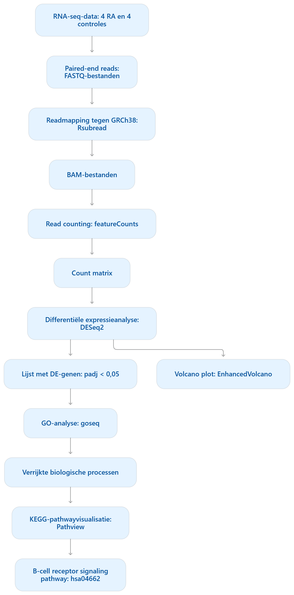
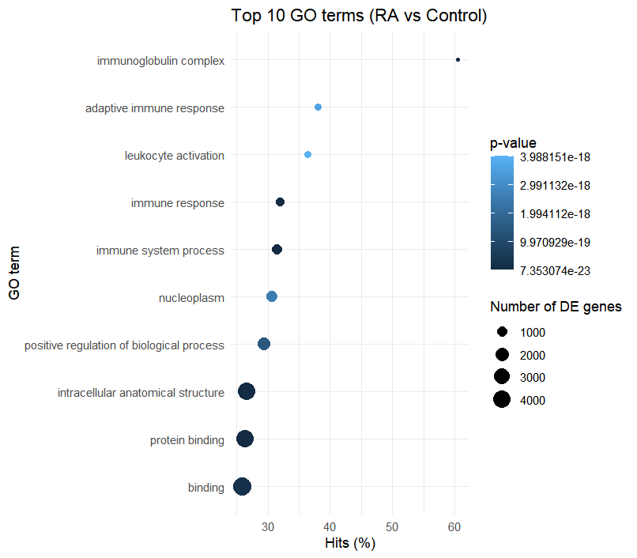

# RA_project
## Transcriptomics analyse van synoviumweefsel van patiënten met reumatoïde artritis

## Inhoud/structuur

In deze repository zijn het R-script, de figuren en het verslag van de transcriptomics-analyse van reumatoïde artritis (RA) opgenomen.

- [Script](Script/) – R-script voor de verwerking en analyse van RNA-seq-data.
- [Figuren](Figuren/) – Workflow, volcano plot, GO-grafiek en KEGG-visualisatie.
- [README.md](README.md) – Verslag van het onderzoek.

### Inhoudsopgave

- [Introductie](#introductie)
- [Methoden](#methoden)
- [Resultaten](#resultaten)
- [Conclusie](#conclusie)
- [Databeheer](#databeheer)
- [Referenties](#referenties)

## Introductie
Reumatoïde artritis (RA) is een chronische systemische auto-immuunziekte die voornamelijk de synoviale gewrichten aantast. De ziekte wordt gekenmerkt door ontsteking van het synovium, wat uiteindelijk kan leiden tot kraakbeenafbraak, boterosie en verlies van gewrichtsfunctie. Hoewel de exacte oorzaak van RA nog niet volledig bekend is, spelen genetische aanleg, omgevingsfactoren en ontregeling van het immuunsysteem een belangrijke rol bij het ontstaan van de ziekte (Gabriel, 2001). Een belangrijk kenmerk van RA is de aanwezigheid van autoantistoffen, waaronder anti-citrullinated protein antibodies (ACPA), die vaak al vóór het ontstaan van klinische symptomen aantoonbaar zijn (Majithia & Geraci, 2007).
Transcriptomics maakt het mogelijk om op grote schaal genexpressie te bestuderen en biedt daardoor inzicht in de moleculaire mechanismen die betrokken zijn bij ziekteprocessen. Door verschillen in genexpressie tussen patiënten en gezonde controles te analyseren, kunnen betrokken genen en biologische pathways worden geïdentificeerd (Wang et al., 2009). Eerdere studies hebben aangetoond dat immuunactivatie, B-celactiviteit, cytokinesignalering en ontstekingsprocessen een centrale rol spelen bij RA (McInnes & Schett, 2011).
In deze studie werd RNA-seq data afkomstig van synoviumbiopten van vier patiënten met vastgestelde RA en vier controlepersonen geanalyseerd. Het doel van het onderzoek was om genen en biologische processen te identificeren die differentieel tot expressie komen bij RA en om de betrokken pathways verder te onderzoeken met behulp van Gene Ontology (GO)- en KEGG-pathwayanalyses. 

## Methoden

Voor deze studie werd gebruikgemaakt van publieke paired-end RNA-sequencingdata afkomstig van synoviumbiopten van vier vrouwelijke patiënten met gevestigde reumatoïde artritis (54–66 jaar) en vier vrouwelijke controlepersonen zonder RA (15–42 jaar).

**Figuur 1.** Overzicht van de uitgevoerde transcriptomics-analyse.

De analyse werd uitgevoerd in R (versie 4.5.2) volgens het stroomschema in Figuur 1. Reads werden met Rsubread (versie 2.24.0) gemapt tegen het humane referentiegenoom GRCh38 (GCF_000001405.26). De resulterende BAM-bestanden werden gesorteerd en geïndexeerd met Rsamtools (versie 2.26.0).

Met featureCounts() werd een count matrix gegenereerd met het bijbehorende NCBI GTF-annotatiebestanden. De gebruikte SRA-runs waren SRR4785979, SRR4785980, SRR4785986 en SRR4785988 voor RA en SRR4785819, SRR4785820, SRR4785828 en SRR4785831 voor de controles. Differentiële genexpressie tussen RA en controles werd bepaald met DESeq2 (versie 1.50.2). Genen met een aangepaste p-waarde (padj) < 0,05 werden als significant beschouwd.

Met goseq (versie 1.62.0) werd een Gene Ontology (GO)-analyse uitgevoerd. Op basis van de GO-resultaten werd de B-cell receptor signaling pathway (hsa04662) geselecteerd. Log2-fold changes werden met Pathview (versie 1.50.0) gekoppeld aan Entrez Gene-ID's en gevisualiseerd op de humane KEGG-pathway.

## Resultaten

De differentiële expressieanalyse liet verschillen in genexpressie zien tussen RA-patiënten en controles. In totaal waren 5119 genen significant differentieel geëxpresseerd (padj < 0,05). Daarvan hadden 2487 genen een log2FC > 1 en 2084 genen een log2FC < -1. Hiervan waren **2487 genen opgereguleerd** en **2084 genen neergereguleerd**. De verdeling van de differentiële genexpressie is weergegeven in **Figuur 2**. Onder de opvallende genen bevonden zich onder andere *BCL2A1*, *ADAMDEC1* en meerdere immunoglobuline-gerelateerde genen, waaronder *IGHV3-53*, *IGHV1-69*, *IGHG4*, *IGHV4-31* en *IGKV2-28*.

**Figuur 2.** Volcano plot van genexpressieverschillen tussen RA-patiënten en controles. De x-as geeft de log2 fold change weer en de y-as de −log10 p-waarde. Grijze punten voldoen niet aan de significantiecriteria, groene punten voldoen aan het log2-fold-changecriterium en rode punten voldoen zowel aan het p-waarde- als het log2-fold-changecriterium.. 

De Gene Ontology-analyse liet zien dat verschillende immuungerelateerde processen significant verrijkt waren (Figuur 3). De meest verrijkte termen waren onder andere immunoglobulin complex, adaptive immune response, leukocyte activation, immune response en immune system process. Vooral de aanwezigheid van *immunoglobulin complex* en *adaptive immune response* wijst erop dat een relatief groot aantal differentieel geëxpresseerde genen betrokken is bij de adaptieve immuunrespons.

**Figuur 3**. Top 10 verrijkte GO-termen van de differentieel geëxpresseerde genen. De grootte van de punten geeft het aantal differentieel geëxpresseerde genen per GO-term weer. De kleur geeft de statistische significantie van de verrijking weer.

Op basis van de verrijking van immuungerelateerde GO-termen werd de **B-cell receptor signaling pathway (hsa04662)** onderzocht. In deze KEGG-pathway werden zowel positieve als negatieve veranderingen in genexpressie waargenomen (**Figuur 4**). Verschillende componenten van de B-cel-signaleringsroute vertoonden veranderde expressie. In combinatie met de immunoglobuline-gerelateerde genen en GO-termen laat dit zien dat genen betrokken bij B-celfunctie verschillen in expressie tussen het RA- en controleweefsel.

**Figuur 4**. KEGG B-cell receptor signaling pathway (hsa04662) met genexpressieveranderingen van RA ten opzichte van controles. Rode vakken geven een positieve log2 fold change aan en groene vakken een negatieve log2 fold change.

## Conclusie

In deze studie werd transcriptomics gebruikt om verschillen in genexpressie tussen synoviumweefsel van patiënten met reumatoïde artritis en controles te onderzoeken. De differentiële expressieanalyse identificeerde een groot aantal genen waarvan de expressie significant verschilde tussen beide groepen. De Gene Ontology-analyse liet zien dat vooral immuungerelateerde processen, waaronder adaptieve immuunrespons, immuunactivatie en immunoglobuline-gerelateerde functies, sterk vertegenwoordigd waren.
De daaropvolgende KEGG-analyse van de B-cell receptor signaling pathway toonde aan dat meerdere genen binnen deze route veranderingen in expressie vertoonden. Deze bevinding sluit aan bij de bekende rol van B-cellen en autoantistofproductie in de pathogenese van reumatoïde artritis. De aanwezigheid van verrijkte immunologische processen en veranderingen binnen B-celgerelateerde signaleringsroutes ondersteunt het belang van adaptieve immuunmechanismen bij deze ziekte.
Een beperking van deze studie is het relatief kleine aantal monsters en het gebruik van subsets van de oorspronkelijke sequencingdata. Toekomstig onderzoek zou gebruik kunnen maken van grotere datasets en aanvullende pathwayanalyses om de betrokken moleculaire mechanismen verder te karakteriseren. Desondanks tonen de resultaten aan dat transcriptomics een waardevolle methode is om biologische processen en genen te identificeren die betrokken zijn bij de ontwikkeling van reumatoïde artritis.
## Databeheer
GitHub werd gebruikt voor versiebeheer en documentatie van de transcriptomics-analyse. Het gebruikte R-script is in de repository opgeslagen en per analysestap voorzien van commentaar, zodat zichtbaar is hoe de ruwe RNA-seq-data zijn verwerkt tot de uiteindelijke resultaten. Figuren en overige outputbestanden zijn in afzonderlijke mappen opgeslagen. Wijzigingen aan bestanden werden met Git-commits vastgelegd, waardoor eerdere versies behouden blijven en aanpassingen aan de analyse traceerbaar zijn. Grote ruwe sequencingbestanden zijn vanwege hun bestandsgrootte niet in de repository opgenomen; de gebruikte dataset en referentiebestanden zijn daarom beschreven met hun oorspronkelijke bron en accessienummers. Deze structuur maakt de analyse transparanter en maakt het mogelijk om de uitgevoerde stappen met dezelfde inputbestanden en software opnieuw uit te voeren

## Referenties
## AI disclaimer 
Voor het maken van dit verslag is AI gebruikt voor het controleren van spelling en grammatica.

### Databronnen

- NCBI Gene Expression Omnibus. *RNAseq study of synovial biopsies*. GEO Series GSE89408. https://www.ncbi.nlm.nih.gov/geo/query/acc.cgi?acc=GSE89408

- Guo, Y., et al. (2017). CD40L-Dependent Pathway Is Active at Various Stages of Rheumatoid Arthritis Disease Progression. *The Journal of Immunology, 198*(11), 4490–4501. https://doi.org/10.4049/jimmunol.1601988

- NCBI. *Homo sapiens genome assembly GRCh38.p14*, GCF_000001405.40. https://www.ncbi.nlm.nih.gov/datasets/genome/GCF_000001405.40/

- NCBI. *Homo sapiens reference genome GRCh38*, GCF_000001405.26. https://www.ncbi.nlm.nih.gov/datasets/genome/GCF_000001405.26/

### R en softwarepackages

- R Core Team. *R: A Language and Environment for Statistical Computing*. R Foundation for Statistical Computing. https://www.r-project.org/

- Liao, Y., Smyth, G. K., & Shi, W. (2019). The R package Rsubread is easier, faster, cheaper and better for alignment and quantification of RNA sequencing reads. *Nucleic Acids Research, 47*(8), e47. https://doi.org/10.1093/nar/gkz114

- Rsamtools. *Bioconductor package*. https://doi.org/10.18129/B9.bioc.Rsamtools

- Love, M. I., Huber, W., & Anders, S. (2014). Moderated estimation of fold change and dispersion for RNA-seq data with DESeq2. *Genome Biology, 15*, 550. https://doi.org/10.1186/s13059-014-0550-8

- EnhancedVolcano. *Bioconductor package*. https://doi.org/10.18129/B9.bioc.EnhancedVolcano

- Young, M. D., Wakefield, M. J., Smyth, G. K., & Oshlack, A. (2010). Gene ontology analysis for RNA-seq: accounting for selection bias. *Genome Biology, 11*, R14. https://doi.org/10.1186/gb-2010-11-2-r14

- goseq. *Bioconductor package*. https://doi.org/10.18129/B9.bioc.goseq

- Wickham, H. (2016). *ggplot2: Elegant Graphics for Data Analysis*. Springer. https://ggplot2.tidyverse.org/

- dplyr. *R package for data manipulation*. https://dplyr.tidyverse.org/

- AnnotationDbi. *Bioconductor package*. https://doi.org/10.18129/B9.bioc.AnnotationDbi

- org.Hs.eg.db. *Bioconductor human gene annotation database*. https://doi.org/10.18129/B9.bioc.org.Hs.eg.db

- Luo, W., & Brouwer, C. (2013). Pathview: An R/Bioconductor package for pathway-based data integration and visualization. *Bioinformatics, 29*(14), 1830–1831. https://doi.org/10.1093/bioinformatics/btt285